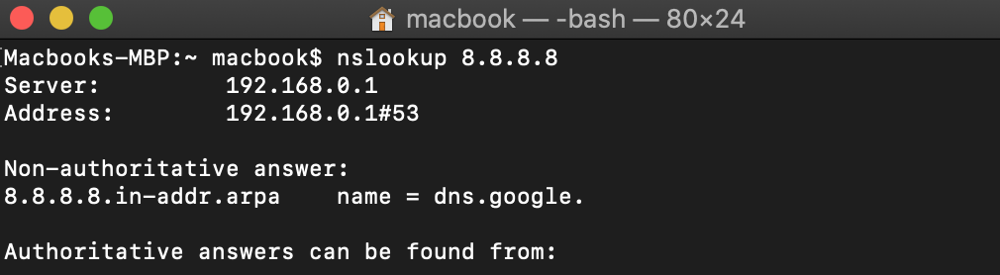
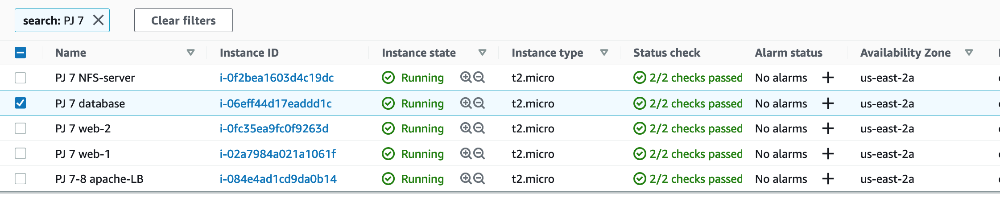
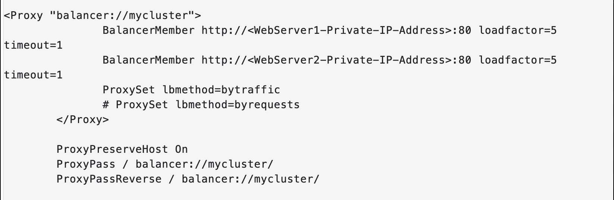
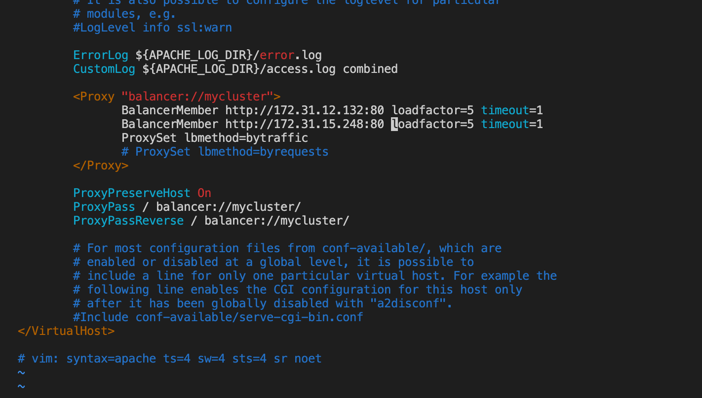
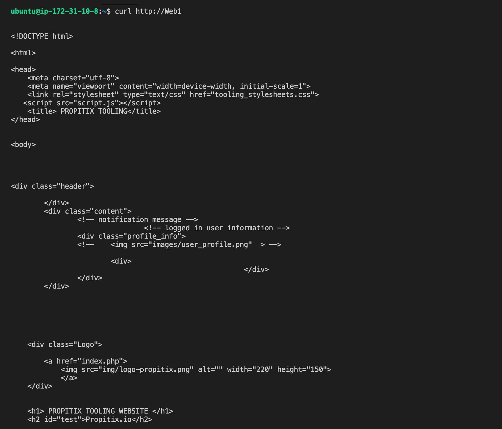
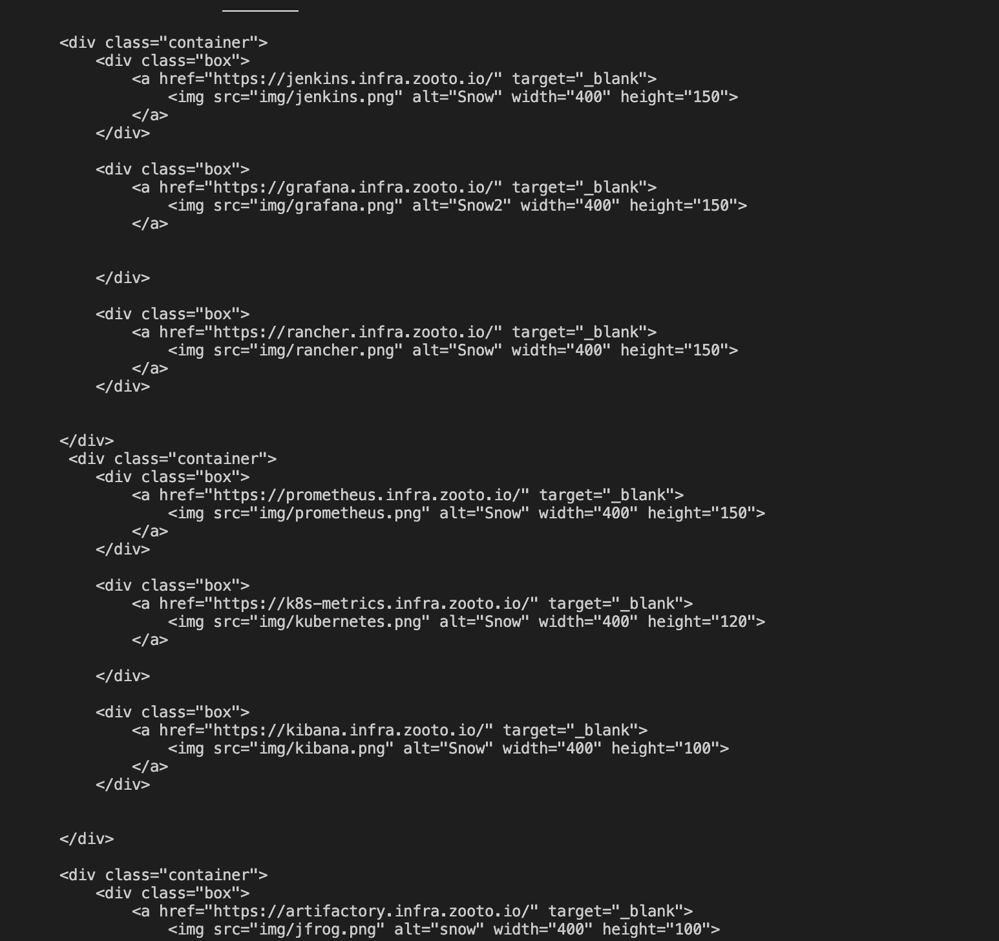
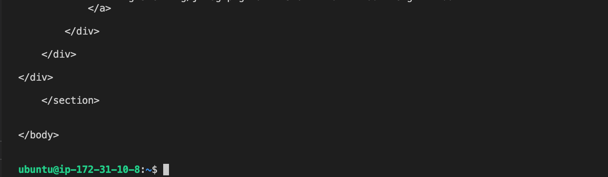
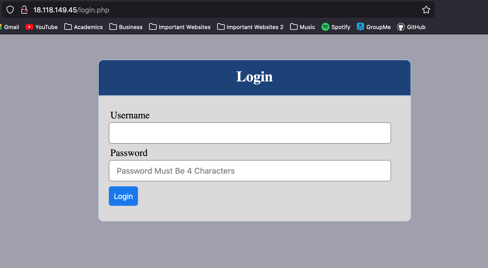

# Load Balancer Solution Using Apache

*Demonstration of how to enhance the website solution that we implemented on project: "devops-website-solution-with-nfs-lvm-step1" by adding a load balancer to distribute traffic between 2 web servers. We will also use a load balancer so that users can access our website by using a single URL. The source code used on this project was retrieved from darey.io.*

- *This project is a continuation of project: "devops-website-solution-using-nfs-and-lvm-step1".*

- *We will continue using
 "devops-website-solution-with-nfs-lvm-step1" EC2 instances to complete this project.*

*Instructions on how to launch and connect to your EC2 instance using an SSH client:*

https://github.com/Antonio447-cloud/MEAN-stack-angular

    Happy Learning!

## Outline

- Deploy and configure an Apache load balancer solution on Ubuntu 20.04 and make sure that our users can be served by web servers through the load balancer.

- Implement this solution with 2 web servers. This approach will be the same for 2 or more web servers.

## Uniform Resource Locators, IP Addresses and Domain Name System 

- When we access a website on the Internet we use a URL (Uniform Resource Locator) and we do not really know how many servers are out there serving our requests, this complexity is hidden from a regular user, but in case of websites that are being visited by millions of users per day (like Google or Reddit) it is impossible to serve all the users from a single web server (it is also applicable to databases, but for now we will not focus on distributed DBs).

- Each URL contains a domain name part, which is translated (resolved) to the IP address of a target server that will serve requests when we open a website on the Internet.

**NOTE**: *Broadly speaking, Internet Protocol (IP) address is a unique number that identifies servers and computers on a network. It is assigned by your ISP (Internet Service Provider) to your computer.*

Translation (resolution) of domain names is performed by Domain Name System (DNS) servers. The most commonly used one has a public IP address 8.8.8.8 and belongs to Google. We can try to query it with the `nslookup` command:

`nslookup 8.8.8.8`

## Load Balancers and Scalability

When we just have one web server and load increases, we want to serve more and more customers. 

To distribute increased traffic, we can add more CPU and RAM or completely replace the server with a more powerful one:

- This is called "vertical scaling". However, vertical scalling has limitations because at some point we will reach the maximum capacity of CPU and RAM that can be installed into our server.

We can also distribute increased traffic across multiple web servers: 

- This is called "horizontal scaling" which consists in adapting the current load by adding (scaling out) or removing (scaling in) web servers.

- Horizontal scalling is much more common because it can be applied almost seamlessly and almost infinitely (you can imagine how many servers Google has to serve billions of search requests).

- Horizontal scaling allows to know the adjustment of number of servers that we need which can be done manually or automatically (for example, based on some monitored metrics like CPU and Memory Load).

**NOTE**: *the property of a system (in our case it is web tier) that handles growing load by adding resources, is called "Scalability".*

In our set up for project "devops-website-solution-with-nfs-lvm-step1" we had 3 web servers and each of them had its own public IP address and public DNS name. So, in order for web clients to access our web servers they would need to use 3 different URLs that would contain 3 different DNS names or 3 different IP addresses. Now, it would not be a nice user experience to remember 3 different IP addresses or 3 different DNS names to make requests to 3 different servers that serve the same website, let alone, imagine doing this with millions of Google servers:

- So, in order to hide all of this complexity from the regular user we can use a Load Balancer (LB) to have a single point of access with a single public IP address or DNS name. 

- A LB distributes web clients’ requests among underlying web servers and makes sure that the load is distributed in an optimal way.

**NOTE**: *Read about different Load Balancing concepts and the difference between L4 Network LB and L7 Application LB*

# Prerequisites

Before starting, we need to make sure that we have the following servers installed and configured based on the instruction of the following  GitHub repository: 

https://github.com/Antonio447-cloud/devops-website-solution-using-nfs-and-lvm-step1

    2 RHEL8 Web Servers
    1 MySQL DB Server (based on Ubuntu 20.04)
    1 RHEL8 NFS server

**NOTE**: *We used 3 web servers on our project: "devops-website-solution-with-nfs-lvm-step1". However, for simplicity we will use 2 web servers instead for this project.*

## Prerequesite Configuration

- Apache (httpd) process is up and running on both web servers.

- "/var/www" directories of both servers are mounted to "/mnt/apps" of the NFS server.

- Our client browser can access both web servers by their respective public IP address or public DNS names and can open our **DevOps Solution Website**.

## Configure Apache as your Load Balancer

To get started we add an Ubuntu Server 20.04 instance to our previous setup and name it "apache-lb". Our list of instances on AWS should look like this:

Now, we open TCP port 80 on our apache-lb EC2 instance by creating an Inbound Rule in our Security Groups.

We need to install Apache LB on our apache-lb instance and configure it to point traffic coming to the LB to both of our web servers. So, to install Apache LB we run:

`sudo apt update`

`sudo apt install apache2 -y`

`sudo apt-get install libxml2-dev -y`

We enable the following modules:

`sudo a2enmod rewrite`

`sudo a2enmod proxy`

`sudo a2enmod proxy_balancer`

`sudo a2enmod proxy_http`

`sudo a2enmod headers`

`sudo a2enmod lbmethod_bytraffic`

We restart apache2 service:

`sudo systemctl restart apache2`

`sudo systemctl status apache2`

We configure load balancing:

`sudo vi /etc/apache2/sites-available/000-default.conf`

We add the following code into the file:

We restart the Apache web server:

`sudo systemctl restart apache2`

- **NOTE**: *The "bytraffic balancing" method will distribute incoming load between our web servers according to the current traffic load. Other methods include bybusyness, byrequests, and heartbeat.*

We need to verify that our configuration works. So, we need to try to access our LB’s public IP address or Public DNS from our web client (web browser).

After veryfing that we can open our servers through our LB, we open two terminals for both web servers and run the following command:

`sudo tail -f /var/log/httpd/access_log`

Then we refresh our browser page:

http://Load-Balancer-Public-IP-Address-or-Public-DNS-Name/index.php 

We refresh it 2 or 3 times and make sure that both servers receive "HTTP GET" requests from our LB. So:

- New records must appear in each server’s log file: `sudo ls -l /var/log`

- The number of requests to each server will be approximately the same since we set loadfactor to the same value for both servers.

- This means that traffic will be distributed evenly between the web servers.

Now that everything is configured correctly, our users will not even notice that their requests are served by more than one server.

- **NOTE**: *Read about different configuration aspects of Apache "mod_proxy_balancer". Also, understand what "sticky session" means and when it is used.*

## Configuring Local DNS Names Resolution

- Sometimes it is tedious to remember and switch between IP addresses, especially if we have a lot of servers under our management.

- What we can do, is to configure local domain name resolution. 

- A good way to do this is to use our /etc/hosts file. Although this approach is not very scalable, it is very easy to configure and shows the concept well. 

 So, we configure the IP address to a domain name mapping for our LB: 

`sudo vi /etc/hosts`

We create the DNS names that we want for both of our servers using each server's private IP address. In my case I will the DNS names "Web1" and "Web2":

`(WebServer1-Private-IP-Address) Web1`

`(WebServer2-Private-IP-Address) Web2`

Now we go into our configuration file:

`sudo vi /etc/apache2/sites-available/000-default.conf`

Then we switch the two private ip addresses listed on the code as `http://172.31.12.132:80`
and `http://172.31.15.248:80` for the 2 DNS names that we just assigned to both of these private IP addresses. So our code on the configuration file should look like this:

`BalancerMember http://Web1:80 loadfactor=5 timeout=1`
`BalancerMember http://Web2:80 loadfactor=5 timeout=1`

Now, we curl our web servers from our LB locally. We can see our website represented in code:

`curl http://Web1` 

`curl http://Web2` 

- **NOTE**: *This is internal configuration only, so it is local to our LB server. The DNS names that we have just configured will neither be resolvable from other servers internally nor from the internet.*

Congrats!! You have just applied a load balancer solution with Apache and configured DNS names resolutions for your website!